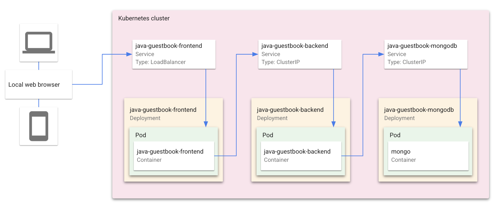
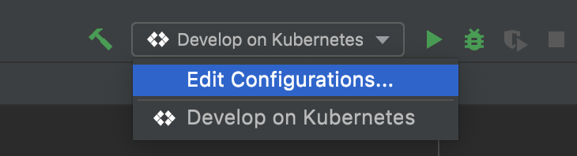
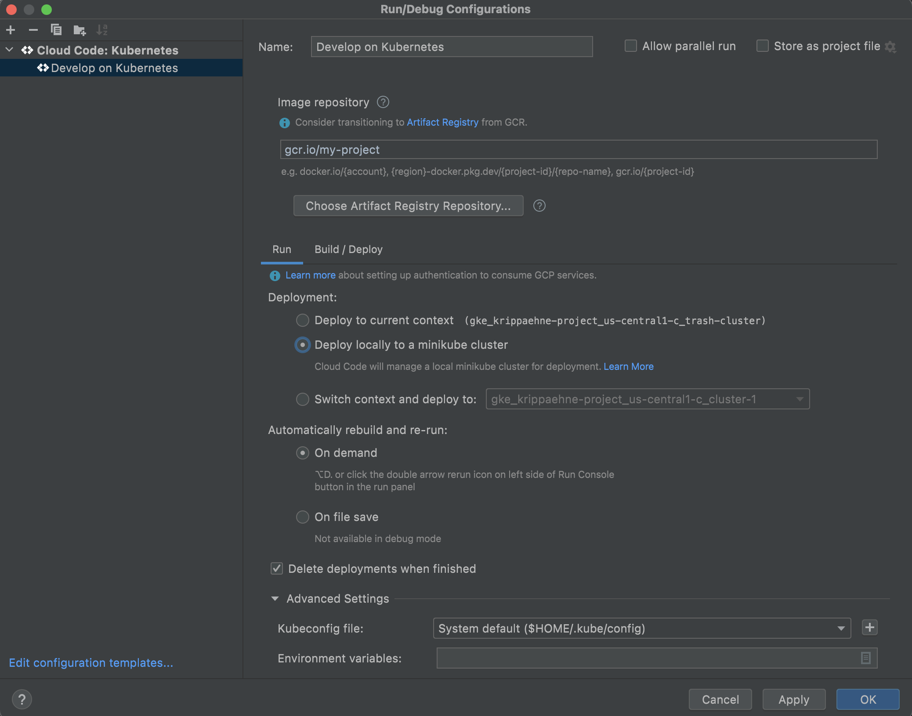

# Guestbook with Cloud Code

The Guestbook sample demonstrates how to deploy a Kubernetes application with a front end service and a back end service using the Cloud Code IDE extension.  

For details on how to use this sample as a template in Cloud Code, read the documentation for Cloud Code for [VS Code](https://cloud.google.com/code/docs/vscode/quickstart-local-dev?utm_source=ext&utm_medium=partner&utm_campaign=CDR_kri_gcp_cloudcodereadmes_012521&utm_content=-) or [IntelliJ](https://cloud.google.com/code/docs/intellij/quickstart-k8s?utm_source=ext&utm_medium=partner&utm_campaign=CDR_kri_gcp_cloudcodereadmes_012521&utm_content=-).

### Table of Contents
* [What's in this sample](#whats-in-this-sample)
* [Getting Started with VS Code](#getting-started-with-vs-code)
* [Getting Started with IntelliJ](#getting-started-with-intellij)
* [Sign up for User Research](#sign-up-for-user-research)

---
## What's in this sample
### Kubernetes architecture

### Directory contents

- `skaffold.yaml` - A schema file that defines skaffold configurations ([skaffold.yaml reference](https://skaffold.dev/docs/references/yaml/))
- `kubernetes-manifests/` - Contains Kubernetes YAML files for the Guestbook services and deployments, including:

  - `guestbook-frontend.deployment.yaml` - deploys a pod with the frontend container image
  - `guestbook-frontend.service.yaml` - creates a load balancer and exposes the frontend service on an external IP in the cluster
  - `guestbook-backend.deployment.yaml` - deploys a pod with the backend container image
  - `guestbook-backend.service.yaml` - exposes the backend service on an internal IP in the cluster
  - `guestbook-mongodb.deployment.yaml` - deploys a pod containing a MongoDB instance
  - `guestbook-mongodb.service.yaml` - exposes the MongoDB service on an internal IP in the cluster

---
## Getting Started with VS Code

### Run the app locally with minikube

#### Edit run configuration
1. Click the configuration dropdown in the top taskbar and then click **Edit Configurations**.
   

   The **Develop on Kubernetes** configuration watches for changes, then uses [skaffold](https://skaffold.dev/docs/) to rebuild and rerun your app. You can customize your deployment by making changes to this run configuration or by creating a new Cloud Code: Kubernetes run configuration.

3. Under **Run > Deployment**, select 'Deploy locally to a minikube cluster'.
   

4. Click **OK** to save your configuration.

#### Run the app on minikube
1. Select **Develop on Kubernetes** from the configuration dropdown and click the run icon. Cloud Code runs your app in a local [minikube](ttps://minikube.sigs.k8s.io/docs/start/) cluster.  
   

2. View the build process in the output window. When the deployment is successful, you're notified that new service URLs are available. Click the Service URLs tab to view the URL(s), then click the URL link to open your browser with your running application.  
   

3. To stop the application, click the stop icon next to the configuration dropdown.

---

## Getting Started with IntelliJ

### Run the app locally with minikube

#### Edit run configuration
1. Click the configuration dropdown in the top taskbar and then click **Edit Configurations**.

   The **Develop on Kubernetes** configuration watches for changes, then uses [skaffold](https://skaffold.dev/docs/) to rebuild and rerun your app. You can customize your deployment by making changes to this run configuration or by creating a new Cloud Code: Kubernetes run configuration.

3. Under **Run > Deployment**, select 'Deploy locally to a minikube cluster'.

4. Click **OK** to save your configuration. 

#### Run the app on minikube
1. Select **Develop on Kubernetes** from the configuration dropdown and click the run icon. Cloud Code runs your app in a local [minikube](ttps://minikube.sigs.k8s.io/docs/start/) cluster.  

2. View the build process in the output window. When the deployment is successful, you're notified that new service URLs are available. Click the Service URLs tab to view the URL(s), then click the URL link to open your browser with your running application.  

3. To stop the application, click the stop icon next to the configuration dropdown.